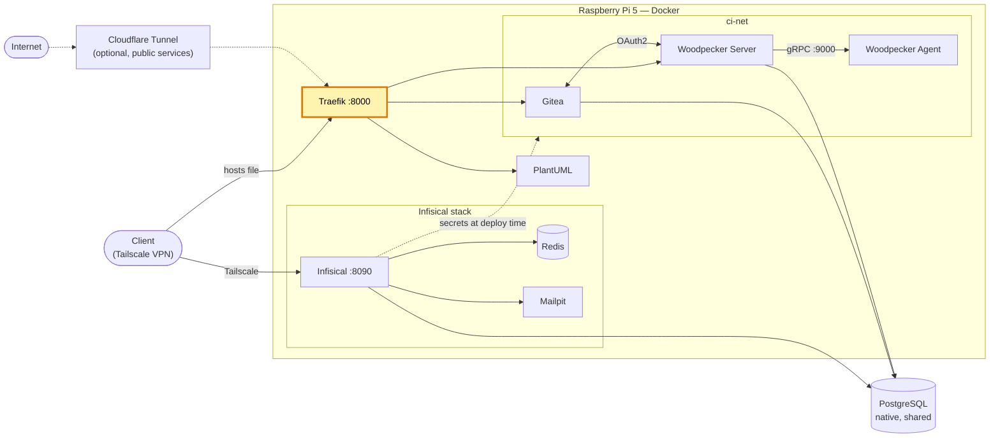

# traefik-homelab — reverse proxy du homelab

[English version](README.md)

[](https://github.com/Alithiel31/traefik-homelab/actions/workflows/lint-markdown.yml) [](LICENSE)   [](https://traefik.io/)

Reverse proxy Traefik v3.6 pour un homelab Raspberry Pi 5. Il route les services internes via les labels Docker et peut se placer derrière un Cloudflare Tunnel (`cloudflared`) : aucun port n'a besoin d'être ouvert sur le routeur.

## Vue d'ensemble

- Entrypoint `web` sur le port `8000` (HTTP seul ; le TLS est terminé par Cloudflare quand le trafic passe par le tunnel).
- Provider Docker avec `exposedbydefault=false` : un conteneur n'est routé que s'il porte `traefik.enable=true` et ses propres labels de routeur.
- Les conteneurs routés doivent rejoindre le réseau externe `traefik-net`.
- `forwardedHeaders.trustedIPs` est limité à l'IP de la passerelle du tunnel pour éviter l'usurpation d'IP client.
- Deux modes d'accès partagent le même entrypoint :
  - Services **publics** : `Internet → Cloudflare → cloudflared → Traefik :8000` (voir [Cloudflare Tunnel](docs/cloudflare-tunnel.fr.md)).
  - Services **internes uniquement** : accessibles via le VPN privé (Tailscale) sur le port `8000`, avec un nom d'hôte résolu par le fichier `hosts` du poste client (voir [Ajouter un service](docs/adding-a-service.fr.md)).

## Architecture du homelab

Place de ce projet dans le homelab (en surbrillance) :



## Choix de conception

- Routage par labels : ajouter un service revient à ajouter des labels dans son propre compose, sans configuration centrale du proxy à modifier.
- Exposition à la demande (`exposedbydefault=false`) : un conteneur n'est jamais joignable par accident.
- Le TLS est terminé chez Cloudflare : aucun certificat à émettre ni à renouveler sur le Pi.
- Un seul entrypoint sert à la fois les services publics (via le tunnel) et les services accessibles uniquement par VPN.

## Prérequis

- Docker + Docker Compose
- *(optionnel)* `cloudflared` et un compte Cloudflare, uniquement pour les services joignables publiquement

## Utilisation

```bash
docker network create traefik-net   # une seule fois
docker compose up -d
```

## Notes de sécurité

- Le socket Docker est monté en lecture seule (`:ro`). Cela limite les écritures mais expose quand même les métadonnées des conteneurs ; un socket proxy serait plus strict.
- Le port `8000` est publié sur **toutes** les interfaces de l'hôte (`8000:8000`). Restreindre l'accès avec le pare-feu de l'hôte (ex. `ufw` : interface VPN et réseaux Docker locaux uniquement).
- Adapter `trustedIPs` à l'adresse de ton tunnel/passerelle.

## Documentation

- [Ajouter un service](docs/adding-a-service.fr.md)
- [Cloudflare Tunnel](docs/cloudflare-tunnel.fr.md)
- [Dépannage](docs/troubleshooting.fr.md)

## Projets liés

Services du même homelab qui se branchent sur cette instance Traefik :

| Dépôt | Rôle |
| --- | --- |
| [woodpecker-ci-homelab](https://github.com/Alithiel31/woodpecker-ci-homelab) | Gitea + Woodpecker CI |
| [plantuml-traefik](https://github.com/Alithiel31/plantuml-traefik) | Serveur PlantUML |
| [infisical-homelab](https://github.com/Alithiel31/infisical-homelab) | Gestionnaire de secrets (pas encore routé via Traefik) |

## Licence

MIT — voir [LICENSE](LICENSE).
