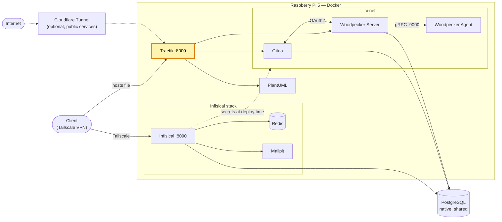

# traefik-homelab — reverse proxy for the homelab

[Version française](README.fr.md)

[](https://github.com/Alithiel31/traefik-homelab/actions/workflows/lint-markdown.yml) [](LICENSE)   [](https://traefik.io/)

Traefik v3.6 reverse proxy for a Raspberry Pi 5 homelab. It routes internal services by Docker labels and can sit behind a Cloudflare Tunnel (`cloudflared`), so no port needs to be opened on the router.

## Overview

- Entrypoint `web` on port `8000` (HTTP only; TLS is terminated by Cloudflare when traffic comes through the tunnel).
- Docker provider with `exposedbydefault=false`: a container is routed only if it has `traefik.enable=true` and its own router labels.
- Routed containers must join the external `traefik-net` network.
- `forwardedHeaders.trustedIPs` is limited to the tunnel's gateway IP so client IPs can't be spoofed.
- Two access modes share the same entrypoint:
  - **Public** services: `Internet → Cloudflare → cloudflared → Traefik :8000` (see [Cloudflare Tunnel](docs/cloudflare-tunnel.md)).
  - **Internal-only** services: reached over the private VPN (Tailscale) on port `8000`, with a hostname resolved through the client's `hosts` file (see [Adding a service](docs/adding-a-service.md)).

## Homelab architecture

Where this project sits in the homelab (highlighted):



## Design choices

- Label-based routing: adding a service means adding labels to its own compose file, with no central proxy configuration to edit.
- Opt-in exposure (`exposedbydefault=false`): a container is never reachable by accident.
- TLS is terminated at Cloudflare, so there are no certificates to issue or renew on the Pi.
- A single entrypoint serves both public services (through the tunnel) and VPN-only services.

## Prerequisites

- Docker + Docker Compose
- *(optional)* `cloudflared` and a Cloudflare account, only for publicly reachable services

## Usage

```bash
docker network create traefik-net   # once
docker compose up -d
```

## Security notes

- The Docker socket is mounted read-only (`:ro`). This limits writes but still exposes container metadata; a socket proxy would be stricter.
- Port `8000` is published on **all** host interfaces (`8000:8000`). Restrict who can reach it with the host firewall (e.g. `ufw`: VPN interface and local Docker networks only).
- Adjust `trustedIPs` to your own tunnel/gateway address.

## Documentation

- [Adding a service](docs/adding-a-service.md)
- [Cloudflare Tunnel](docs/cloudflare-tunnel.md)
- [Troubleshooting](docs/troubleshooting.md)

## Related projects

Services of the same homelab that plug into this Traefik instance:

| Repository | Role |
| --- | --- |
| [woodpecker-ci-homelab](https://github.com/Alithiel31/woodpecker-ci-homelab) | Gitea + Woodpecker CI |
| [plantuml-traefik](https://github.com/Alithiel31/plantuml-traefik) | PlantUML server |
| [infisical-homelab](https://github.com/Alithiel31/infisical-homelab) | Secrets manager (not routed through Traefik yet) |

## License

MIT — see [LICENSE](LICENSE).
